# ADR Dependency Graph

This document maps the final dependency structure across `ADR-001` through `ADR-043`.

## High-Level Graph

```mermaid
flowchart TD
  A001["001 North Star"]

  A001 --> A002["002 Fjall Storage"]
  A001 --> A003["003 Raw Binary Execution"]
  A001 --> A004["004 Code-as-Workflow"]
  A001 --> A007["007 Dioxus UI"]
  A001 --> A027["027 Exactly-Once Core"]

  A002 --> A005["005 Hibernation and Timers"]
  A002 --> A016["016 Atomic Batches and Snapshots"]
  A002 --> A020["020 Key Encoding"]
  A002 --> A025["025 Privacy and GDPR"]
  A002 --> A032["032 Write QoS / Hot-Cold"]
  A002 --> A037["037 Rebuildable Projections"]
  A002 --> A038["038 Continue-As-New"]
  A002 --> A040["040 Blob Durability"]

  A003 --> A011["011 Current-Thread Runtime"]
  A003 --> A012["012 Boundary Hardening"]
  A003 --> A014["014 Secure IPC"]
  A003 --> A018["018 Pipe Deadlocks"]
  A003 --> A019["019 SIGTERM Handling"]
  A003 --> A023["023 Stderr Guard"]
  A003 --> A030["030 Managed Effects"]
  A003 --> A033["033 Fairness Classes"]

  A004 --> A009["009 Multi-Task Binary"]
  A004 --> A010["010 Compile-Time DAG Safety"]
  A004 --> A031["031 Canonical WorkflowSpec"]

  A005 --> A013["013 System Resilience"]
  A005 --> A016
  A005 --> A039["039 Hierarchical Lifecycle"]
  A005 --> A042["042 Signal / Wake Semantics"]

  A006["006 Backpressure"] --> A015["015 Actor Invariants"]
  A006 --> A033

  A007 --> A024["024 SSE Limits"]
  A007 --> A031

  A008["008 AI Interfaces"] --> A031
  A008 --> A035["035 Upcasting"]

  A009 --> A017["017 Version Pinning"]
  A009 --> A031

  A010 --> A022["022 DAG Cycle Validation"]

  A012 --> A014
  A012 --> A017
  A014 --> A018

  A013 --> A027
  A013 --> A033

  A016 --> A027
  A016 --> A035
  A016 --> A040

  A017 --> A021["021 Ghost Workflow Lifecycle"]
  A017 --> A027

  A020 --> A027
  A021 --> A031
  A022 --> A027

  A025 --> A027
  A025 --> A037

  A027 --> A028["028 Ingress Dedupe"]
  A027 --> A029["029 Fencing"]
  A027 --> A030
  A027 --> A035
  A027 --> A036["036 Command Identity"]
  A027 --> A039
  A027 --> A040
  A027 --> A041["041 Connector Runtime"]
  A027 --> A042
  A027 --> A043["043 Verification Strategy"]

  A028 --> A036
  A028 --> A042

  A030 --> A034["034 Compensation"]
  A030 --> A041

  A031 --> A038
  A031 --> A042

  A032 --> A040

  A034 --> A039
  A034 --> A041

  A038 --> A037
  A038 --> A042
```

## Dependency Layers

1. **North Star**
   - `001`

2. **Execution and Storage Pillars**
   - `002`, `003`, `004`, `007`

3. **Operational Hardening**
   - `005`, `006`, `011`, `012`, `013`, `014`, `015`, `016`, `017`, `018`, `019`, `020`, `021`, `022`, `023`, `024`, `025`, `026`

4. **Exactly-Once Core Contracts**
   - `027`, `028`, `029`, `030`, `031`, `032`, `033`, `034`

5. **Long-Lived Durability / Product Maturity Contracts**
   - `035`, `036`, `037`, `038`, `039`, `040`, `041`, `042`, `043`

## Critical Paths

### Exactly-Once Core
`001 -> 002 -> 016 -> 027 -> 028 -> 029 -> 030 -> 041 -> 043`

### Canonical Workflow Model
`001 -> 004 -> 009 -> 031 -> 007`

### Long-Lived Workflow Durability
`002 -> 016 -> 035 -> 038 -> 042`

### Suspended / Waiting Workflows
`002 -> 005 -> 013 -> 027 -> 042`

### Privacy Without Breaking Replay
`002 -> 025 -> 040 -> 027`
